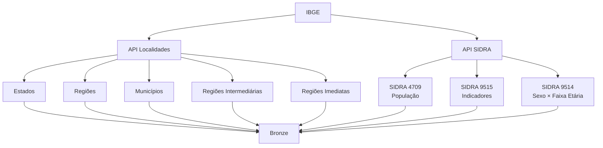

# Integrações IBGE

```mermaid
flowchart TB

    IBGE["IBGE"]

    LOCALIDADES["API Localidades"]

    SIDRA["API SIDRA"]

    ESTADOS["Estados"]

    REGIOES["Regiões"]

    MUNICIPIOS["Municípios"]

    INTERMEDIARIAS["Regiões Intermediárias"]

    IMEDIATAS["Regiões Imediatas"]

    T4709["SIDRA 4709
    População"]

    T9515["SIDRA 9515
    Indicadores"]

    T9514["SIDRA 9514
    Sexo × Faixa Etária"]

    BRONZE["Bronze"]

    IBGE --> LOCALIDADES
    IBGE --> SIDRA

    LOCALIDADES --> ESTADOS
    LOCALIDADES --> REGIOES
    LOCALIDADES --> MUNICIPIOS
    LOCALIDADES --> INTERMEDIARIAS
    LOCALIDADES --> IMEDIATAS

    SIDRA --> T4709
    SIDRA --> T9515
    SIDRA --> T9514

    ESTADOS --> BRONZE
    REGIOES --> BRONZE
    MUNICIPIOS --> BRONZE
    INTERMEDIARIAS --> BRONZE
    IMEDIATAS --> BRONZE
    T4709 --> BRONZE
    T9515 --> BRONZE
    T9514 --> BRONZE
```