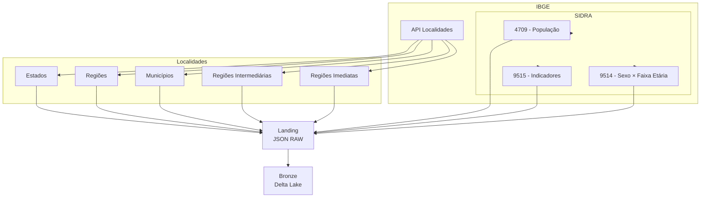

# Integrações IBGE

```mermaid
flowchart TB

    subgraph IBGE["IBGE"]
        LOCALIDADES["API Localidades"]
        SIDRA["API SIDRA"]
    end

    subgraph Localidades
        ESTADOS["Estados"]
        REGIOES["Regiões"]
        MUNICIPIOS["Municípios"]
        INTERMEDIARIAS["Regiões Intermediárias"]
        IMEDIATAS["Regiões Imediatas"]
    end

    subgraph SIDRA
        T4709["4709 - População"]
        T9515["9515 - Indicadores"]
        T9514["9514 - Sexo × Faixa Etária"]
    end

    LANDING["Landing
    JSON RAW"]

    BRONZE["Bronze
    Delta Lake"]

    LOCALIDADES --> ESTADOS
    LOCALIDADES --> REGIOES
    LOCALIDADES --> MUNICIPIOS
    LOCALIDADES --> INTERMEDIARIAS
    LOCALIDADES --> IMEDIATAS

    SIDRA --> T4709
    SIDRA --> T9515
    SIDRA --> T9514

    ESTADOS --> LANDING
    REGIOES --> LANDING
    MUNICIPIOS --> LANDING
    INTERMEDIARIAS --> LANDING
    IMEDIATAS --> LANDING

    T4709 --> LANDING
    T9515 --> LANDING
    T9514 --> LANDING

    LANDING --> BRONZE
```