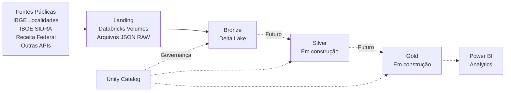

# Pipeline de Ingestão

```mermaid
flowchart LR

    A["Fontes Públicas<br/>IBGE Localidades<br/>IBGE SIDRA<br/>Receita Federal<br/>Outras APIs"]

    B["Landing<br/>Databricks Volumes<br/>Arquivos JSON RAW"]

    C["Bronze<br/>Delta Lake"]

    D["Silver<br/>Em construção"]

    E["Gold<br/>Em construção"]

    F["Power BI<br/>Analytics"]

    A --> B
    B --> C
    C -. Futuro .-> D
    D -. Futuro .-> E
    E -.-> F

    UC["Unity Catalog"]
    UC -. Governança .-> C
    UC -.-> D
    UC -.-> E
```