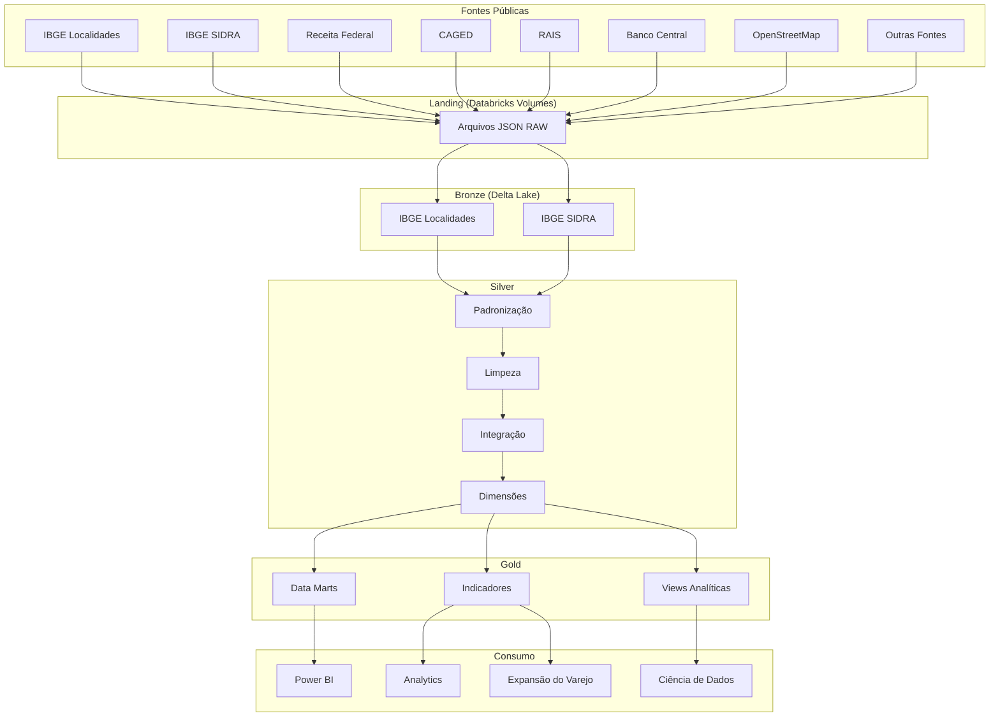

# Diagrama da Arquitetura Lakehouse

```mermaid
flowchart TB

    subgraph FONTES["Fontes Públicas"]
        A1["IBGE Localidades"]
        A2["IBGE SIDRA"]
        A3["Receita Federal"]
        A4["CAGED"]
        A5["RAIS"]
        A6["Banco Central"]
        A7["OpenStreetMap"]
        A8["Outras Fontes"]
    end

    subgraph LANDING["Landing (Databricks Volumes)"]
        B["Arquivos JSON RAW"]
    end

    subgraph BRONZE["Bronze (Delta Lake)"]
        C1["IBGE Localidades"]
        C2["IBGE SIDRA"]
    end

    subgraph SILVER["Silver"]
        D1["Padronização"]
        D2["Limpeza"]
        D3["Integração"]
        D4["Dimensões"]
    end

    subgraph GOLD["Gold"]
        E1["Data Marts"]
        E2["Indicadores"]
        E3["Views Analíticas"]
    end

    subgraph CONSUMO["Consumo"]
        F1["Power BI"]
        F2["Analytics"]
        F3["Ciência de Dados"]
        F4["Expansão do Varejo"]
    end

    A1 --> B
    A2 --> B
    A3 --> B
    A4 --> B
    A5 --> B
    A6 --> B
    A7 --> B
    A8 --> B

    B --> C1
    B --> C2

    C1 --> D1
    C2 --> D1

    D1 --> D2
    D2 --> D3
    D3 --> D4

    D4 --> E1
    D4 --> E2
    D4 --> E3

    E1 --> F1
    E2 --> F2
    E3 --> F3
    E2 --> F4
```